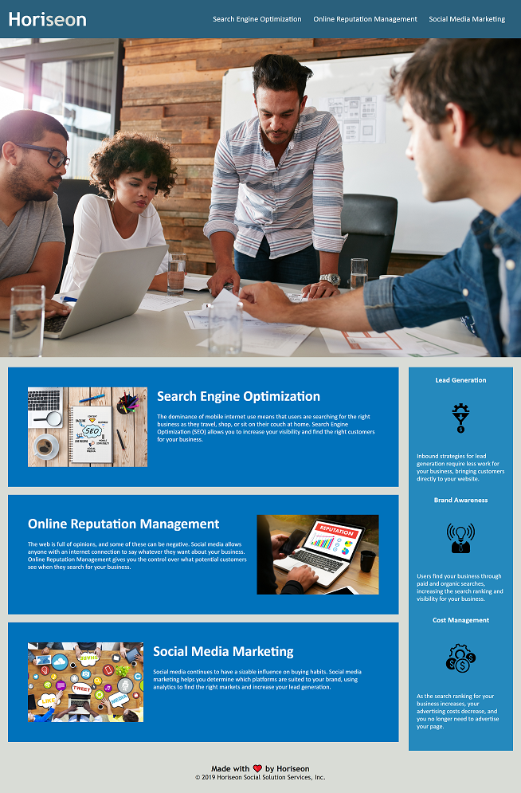

# Challenge 1: Code Refactor

## Description

With this project, my goal was to add/correct any elements that were non-semantic in the given starter code, and in general, make the code more accessible. Adding semantic elements helps fellow developers understand better what is going on with the code, and making the code more accessible (such as adding image descriptions) helps individuals with disability. This code refactor should also help improve search engine optimization, meaning that anyone who would search google, bing, or any other similar search engines, should have an easier time finding this website. Through this I learned the importance of knowing different element tags, and how changing certain tags can mess with css elements, so it's good to go through the code slowly and thorougly when refactoring.

## User Story

* AS A marketing agency

* I WANT a codebase that follows accessibility standards

* SO THAT our own site is optimized for search engines

## Acceptance Criteria

* GIVEN a webpage meets accessibility standards

* WHEN I view the source code

* THEN I find semantic HTML elements

* WHEN I view the structure of the HTML elements

* THEN I find that the elements follow a logical structure independent of styling and positioning

* WHEN I view the image elements

* THEN I find accessible alt attributes

* WHEN I view the heading attributes

* THEN they fall in sequential order

* WHEN I view the title element
* THEN I find a concise, descriptive title

## Installation

N/A

## Deployed Application

The deployed application can be found at this link:
https://jsheen98.github.io/coding-bootcamp-challenge-1/

## Assets

The following image demonstratres the website's appearance:

## License

Please refer to the LICENSE in the repo

